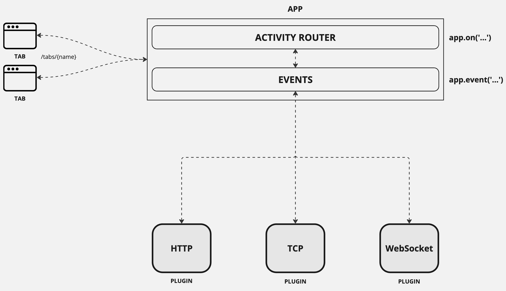

img src="./assets/icons/icon.png" width="50px" /> Teams SDK: Typescript

<a href="#">
    
</a>
<a href="https://github.com/microsoft/teams.ts/actions/workflows/pages/pages-build-deployment">
    
</a>

A comprehensive suite of packages designed to simplify and streamline development for the Microsoft Teams Platform a feature-rich messaging platform that enables immersive app experiences.

<a href="https://microsoft.github.io/teams.ts/2.getting-started/1.create-application.html" target="_blank">
    
</a>

---

# For Users

## What is Teams AI SDK (v2)?

Teams AI SDK (v2) is a modern flexible SDK that empowers developers to build powerful applications bots and AI agents for Microsoft Teams with less code and fewer dependencies. It provides a cohesive set of tools and abstractions that work together seamlessly allowing you to focus on creating intelligent and effective solutions rather than managing complex configurations and boilerplate code.

Microsoft Teams development often involves working with multiple disconnected libraries and tools. Teams AI SDK (v2) unifies this experience by consolidating functionality previously spread across `teams-js` `botbuilder` `teamsfx` and `adaptivecards` into a single cohesive suite of packages with consistent interfaces and improved developer experience.

## Key Features

- **Streamlined Development Experience** - Minimize boilerplate code and reduce setup complexity
- **Unified Tooling** - A cohesive suite that consolidates functionality previously spread across multiple libraries
- **AI-Native Abstractions** - Built-in support for integrating AI capabilities into your Teams applications
- **Flexible & Unopinionated** - Provides tools and abstractions without dictating application architecture
- **Low Dependency** - Designed for longevity with minimal external dependencies
- **Integrated Developer Tools** - Local development debugging and testing tools built right in
- **Comprehensive Documentation** - Clear concise guides and examples to get you started quickly

## Prerequisites

Before getting started with Teams AI SDK (v2) ensure you have:

- [Node.js](https://nodejs.org/en/download) >= 20

## Quick Start

```bash
# Install the CLI
npm install -g @microsoft/teams.cli@latest

# Create a new project
teams new my-teams-app
# Optional flags:
# --template <template-name> - Select a base template for the project
# --ttk <config-name> - Include a Teams Toolkit configuration
# --start - Also install dependencies and start the app

# Navigate to your project
cd my-teams-app

# Start the development server
npm run dev
```

> **Note:** If you don't want to install the CLI globally you can also use `npx @microsoft/teams.cli <command>`.

## Architecture Overview



Teams AI SDK (v2) unifies the Teams development experience by bringing together capabilities previously spread across multiple libraries and tools into a single cohesive suite of packages.

## Packages

### Core Functionality
- [`@microsoft/teams.apps`](./packages/apps/README.md) - Tools for building server-side apps for Microsoft Teams ([Documentation](https://microsoft.github.io/teams.ts/1.welcome/#microsoftteamsapps))
- [`@microsoft/teams.api`](./packages/api/README.md) - Core types and client implementations for the Teams Platform API used for fetching data authentication and sending activities ([Documentation](https://microsoft.github.io/teams.ts/1.welcome/#microsoftteamsapi))
- [`@microsoft/teams.client`](./packages/client/README.md) - A client used to create app/bot surfaces such as tabs using Teams AI SDK (v2) ([Documentation](https://microsoft.github.io/teams.ts/1.welcome/#microsoftteamsclient))
- [`@microsoft/teams.common`](./packages/common/README.md) - Common implementations used by all packages for example logging ([Documentation](https://microsoft.github.io/teams.ts/1.welcome/#microsoftteamscommon))
- [`@microsoft/teams.config`](./packages/config/README.md) - Configuration management for Teams AI SDK (v2) applications ([Documentation](https://microsoft.github.io/teams.ts/1.welcome/#microsoftteamsconfig))

### AI & Integration
- [`@microsoft/teams.ai`](./packages/ai/README.md) - Tools that make it easier to integrate apps with LLMs and enable multi-agent scenarios ([Documentation](https://microsoft.github.io/teams.ts/8.ai/)) with three main components:
  - **Models**: Interface with LLMs handling input/output and making LLM features compatible with Teams AI SDK (v2)
  - **Templates**: Parse instructions or "System Prompts" with support for custom templating languages
  - **Prompts**: Orchestrate everything handling state management function definitions and model/template invocation
- [`@microsoft/teams.openai`](./packages/openai/README.md) - AI model implementations for OpenAI allowing you to integrate your models with the core `@microsoft/teams.ai` package ([Documentation](https://microsoft.github.io/teams.ts/1.welcome/#microsoftteamsopenai))
- [`@microsoft/teams.graph`](./packages/graph/README.md) - Microsoft Graph API client for seamless integration with Microsoft 365 services ([Documentation](https://microsoft.github.io/teams.ts/1.welcome/#microsoftteamsgraph))
- [`@microsoft/teams.botbuilder`](./packages/botbuilder/README.md) - A plugin implementation allowing developers to integrate an existing `botbuilder` Adapter into a project using Teams AI SDK (v2) while still leveraging Teams AI SDK (v2)'s new typings and routing system ([Documentation](https://microsoft.github.io/teams.ts/1.welcome/#microsoftteamsbotbuilder))

### UI & Experience
- [`@microsoft/teams.cards`](./packages/cards/README.md) - Adaptive Cards typings and builders for type-safe and intuitive card design ([Documentation](https://microsoft.github.io/teams.ts/1.welcome/#microsoftteamscards))

### Developer Tools
- [`@microsoft/teams.cli`](./packages/cli/README.md) - A CLI for building apps using Teams AI SDK (v2) with support for project scaffolding and AI-assisted development ([Documentation](https://microsoft.github.io/teams.ts/1.welcome/#microsoftteamscli))
- [`@microsoft/teams.dev`](./packages/dev/README.md) - Developer tools to streamline the development process ([Documentation](https://microsoft.github.io/teams.ts/1.welcome/#microsoftteamsdev))
- [`@microsoft/teams.devtools`](./packages/devtools/README.md) - Local development and debugging tools for testing your Teams AI SDK (v2) applications ([Documentation](https://microsoft.github.io/teams.ts/7.devtools/))

## Sample Applications

Explore these sample applications to see Teams AI SDK (v2) in action:

- [`@samples/echo`](./samples/echo/README.md) - Basic echo bot implementation
- [`@samples/botbuilder`](./samples/botbuilder/README.md) - BotBuilder integration example
- [`@samples/auth`](./samples/auth/README.md) - Authentication flow demonstration
- [`@samples/lights`](./samples/lights/README.md) - IoT-style control example
- [`@samples/tab`](./samples/tab/README.md) - Teams tab application
- [`@samples/mcp`](./samples/mcp/README.md) - Model Context Protocol example

## User Resources

- [Documentation](https://microsoft.github.io/teams.ts)
  - [Welcome & Package Overview](https://microsoft.github.io/teams.ts/1.welcome/)
  - [Getting Started Guide](https://microsoft.github.io/teams.ts/2.getting-started/)
  - [Basic Concepts](https://microsoft.github.io/teams.ts/3.basics/)
  - [Dialogs](https://microsoft.github.io/teams.ts/4.dialogs/)
  - [Message Extensions](https://microsoft.github.io/teams.ts/5.message-extensions/)
  - [Cards](https://microsoft.github.io/teams.ts/6.cards/)
  - [DevTools](https://microsoft.github.io/teams.ts/7.devtools/)
  - [AI Integration](https://microsoft.github.io/teams.ts/8.ai/)
  - [Activity Handling](https://microsoft.github.io/teams.ts/9.activity/)
- [Teams Developer Portal](https://dev.teams.microsoft.com/apps)
- [Support](./SUPPORT.md)

---

# For Contributors

## Project Structure

Teams AI SDK (v2) uses a monorepo structure managed by npm workspaces and Turbo for efficient builds and dependency management. The repository is organized as follows:

- `/packages` - Core packages that make up the Teams AI SDK (v2) SDK
- `/samples` - Example applications demonstrating Teams AI SDK (v2) usage
- `/book` - Source for the documentation (written in Markdown)
- `/docs` - Built documentation (auto-generated from `/book`)
- `/assets` - Images and other static assets
- `/external` - External dependencies and integrations

## Development Environment Setup

1. **Clone the repository**
   ```bash
   git clone https://github.com/microsoft/teams.ts.git
   cd teams.ts
   ```

2. **Install dependencies**
   ```bash
   npm install
   ```

3. **Build all packages**
   ```bash
   npm run build
   ```

## Common Development Scripts

> All scripts can be run for a particular workspace by appending `--workspace=${name}`

```bash
# Build all packages
npm run build

# Clean build artifacts
npm run clean

# Format code
npm run fmt

# Run development server (for apps/samples)
npm run dev

# Run tests (for packages)
npm run test
```

## Documentation Development

Teams AI SDK (v2) uses `mdbook` for documentation. The source files are in Markdown format in the `book/src` directory.

### Prerequisites for Documentation Development

1. **Install Rust and Cargo**
   - Follow the [Rust installation guide](https://www.rust-lang.org/tools/install)
   - Configure your shell for Cargo:
     ```sh
     # Configure shell for cargo
     cd $HOME/.cargo
     source $HOME/.cargo/env
     echo $PATH # Should see cargo/bin in the path
     source ~/.zshrc # or ~/.bashrc
     ```

2. **Install mdbook tools**
   ```sh
   cargo install mdbook
   cargo install mdbook-theme
   ```

### Working with Documentation

- **Serve documentation locally**
  ```bash
  npm run docs:serve
  ```
  This will start the documentation on http://localhost:3000 with auto-reload.

- **Build documentation**
  ```bash
  npm run docs:build
  ```
  This converts Markdown files to HTML in the `/docs` directory.

> **Important:** Do not edit files in the `/docs` directory directly as they are auto-generated.

### Adding Documentation Content

- To add content create a new Markdown file in the `book/src` directory
- To add a new section create a new directory in `book/src` with a `README.md` file
- Update `SUMMARY.md` to include your new content
- Sub-chapters should be added as folders under the section with a new `README.md` file

## Contributing Guidelines

We welcome contributions to Teams AI SDK (v2)! Whether you're fixing bugs improving documentation or proposing new features your help is appreciated.

### Contribution Process

1. **Fork the repository**
2. **Create a feature branch**
3. **Make your changes**
4. **Update documentation** to reflect your changes
5. **Run tests** to ensure your changes don't break existing functionality
6. **Submit a pull request**

### Code Standards

- Follow the existing code style (enforced by Prettier and ESLint)
- Write tests for new functionality
- Update documentation for any changes

For more detailed information please see:

- [Code of Conduct](./CODE_OF_CONDUCT.md)
- [Contribution Guidelines](./CONTRIBUTING.MD)
- [Documentation Guide](https://microsoft.github.io/teams.ts/9.contributing/)
- [Release Notes](./RELEASE.md)
- [Security Policy](./SECURITY.md)
