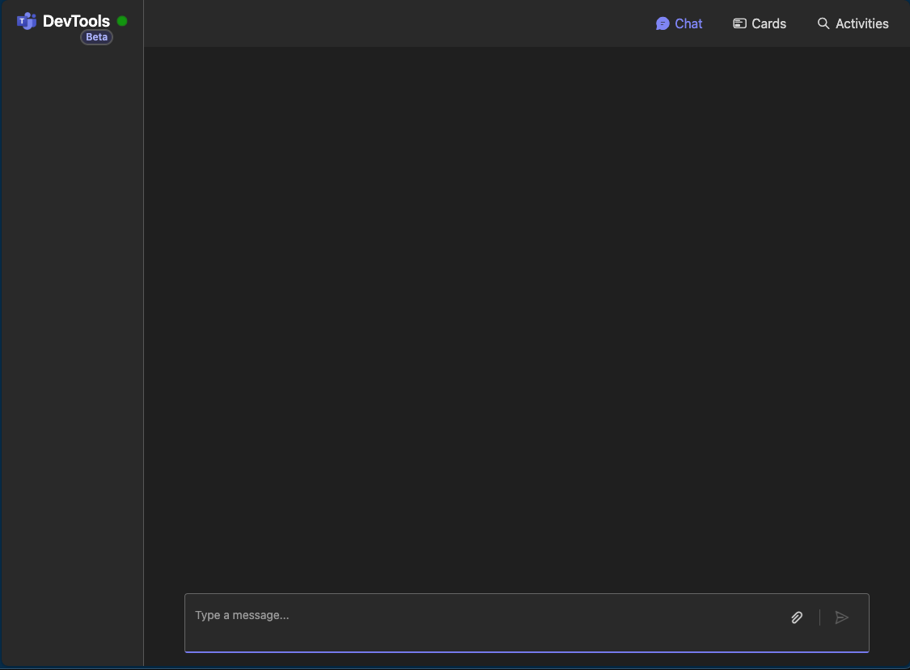
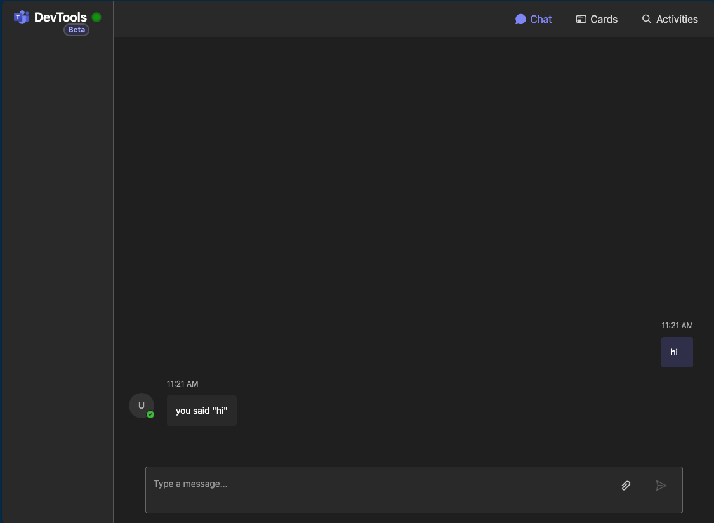
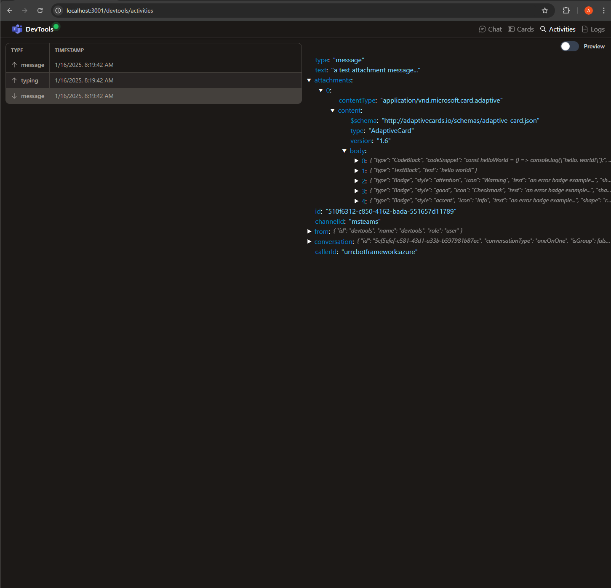
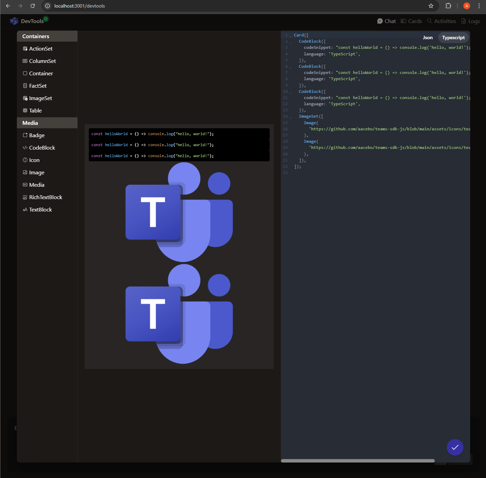

# 🏃‍♂️ Running Your App

Once you've created your Teams AI SDK application, you'll want to run it locally to test and develop it. This guide covers how to start your application, use the integrated DevTools, and common debugging techniques.

## Starting Your Application

Teams AI SDK applications include several npm scripts for different development tasks:

### Development Mode

For active development with auto-reload when files change:

```sh
npm run dev
```

This command:
1. Watches your source files for changes
2. Automatically restarts the application when changes are detected
3. Uses `ts-node` to run TypeScript directly without a separate build step
4. Loads environment variables from `.env` files

This is the recommended approach during development.

### Production Mode

To run your application in production mode:

```sh
npm run build
npm start
```

This sequence:
1. Compiles your TypeScript code to JavaScript (`npm run build`)
2. Runs the compiled JavaScript (`npm start`)

Use this approach to test your application in a production-like environment.

## Using DevTools

Teams AI SDK includes powerful integrated development tools through the `DevtoolsPlugin`. This plugin is automatically included in the templates and provides a local chat interface, activity inspector, and card designer.

### Accessing DevTools

When your application is running, DevTools are available at:

```
http://localhost:3000/devtools
```

You'll see a web interface with several tabs:



### Chat Interface

The chat interface allows you to interact with your bot as if you were a user in Teams:

1. Type a message in the input box at the bottom
2. Press Enter or click the send button
3. Your bot will respond based on your implemented handlers



This is useful for testing your bot's responses to different messages and commands.

### Activity Inspector

The Activity Inspector shows the raw activity objects being sent and received:

1. Send a message in the chat interface
2. Click the "Inspect" tab
3. View the detailed activity object



This helps you understand the structure of activities and debug issues with your handlers.

### Card Designer

If your application uses Adaptive Cards, the Card Designer allows you to create and test cards:

1. Click the "Cards" tab
2. Design your card using the visual editor or JSON editor
3. Preview how it will look in Teams



## Environment Configuration

Teams AI SDK applications use `.env` files for configuration. If you created your app with the `--ttk` option, these files are already set up.

### Basic Configuration

A typical `.env` file might include:

```
# Server configuration
PORT=3000
HOST=localhost

# Application settings
APP_ID=your-app-id
APP_PASSWORD=your-app-password

# Additional settings based on template
# (e.g., API keys for AI template, Graph permissions for Graph template)
```

### Environment-Specific Configuration

You can have different configurations for different environments:

- `.env`: Base configuration, shared across all environments
- `.env.local`: Local overrides, not committed to source control
- `.env.development`: Development-specific settings
- `.env.production`: Production-specific settings

## Debugging Techniques

### Console Logging

Teams AI SDK provides a built-in logging system:

```typescript
app.on('message', async ({ log, activity }) => {
  log.info('Received message:', activity.text);
  log.debug('Full activity:', activity);
  
  // Handle the message
});
```

Log levels include:
- `debug`: Detailed debugging information
- `info`: General information
- `warn`: Warning messages
- `error`: Error messages

### Using Node.js Debugger

You can use the Node.js debugger with VS Code:

1. Create a `.vscode/launch.json` file:
   ```json
   {
     "version": "0.2.0",
     "configurations": [
       {
         "type": "node",
         "request": "launch",
         "name": "Launch Program",
         "skipFiles": ["<node_internals>/**"],
         "program": "${workspaceFolder}/src/index.ts",
         "outFiles": ["${workspaceFolder}/dist/**/*.js"],
         "runtimeArgs": ["-r", "ts-node/register", "-r", "dotenv/config"],
         "console": "integratedTerminal"
       }
     ]
   }
   ```

2. Set breakpoints in your code
3. Press F5 or click the debug icon in VS Code
4. The application will pause at your breakpoints, allowing you to inspect variables and step through code

## Common Issues and Solutions

### Port Already in Use

If you see an error like `EADDRINUSE: address already in use :::3000`:

1. Find the process using the port:
   ```sh
   # On Windows
   netstat -ano | findstr :3000
   
   # On macOS/Linux
   lsof -i :3000
   ```

2. Stop the process or change the port in your `.env` file:
   ```
   PORT=3001
   ```

### Missing Dependencies

If you see errors about missing modules:

```sh
npm install
```

This ensures all dependencies are installed correctly.

### TypeScript Errors

If you encounter TypeScript compilation errors:

1. Check the error message for the file and line number
2. Fix the type issues in your code
3. If using references to other packages, ensure they're correctly imported

## What's Next?

Now that you can run and test your application:

1. **Add custom functionality** to handle different types of activities
2. **Create Adaptive Cards** for rich interactive experiences
3. **Integrate with external services** like databases or APIs

Check out the next guide on [Development Workflow](./4.development-workflow.md) to learn best practices for developing Teams AI SDK applications.
