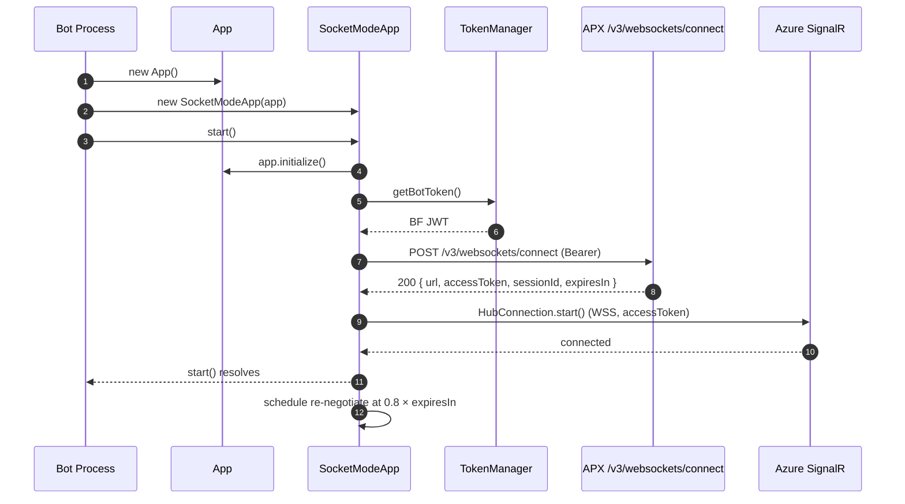
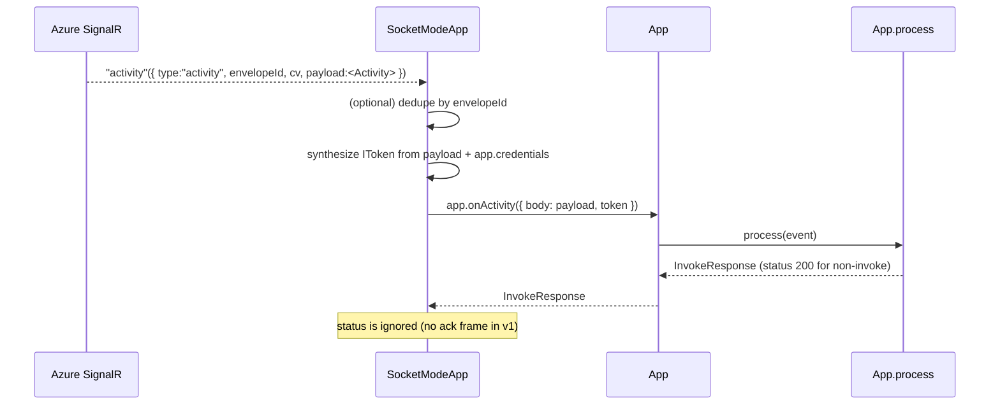
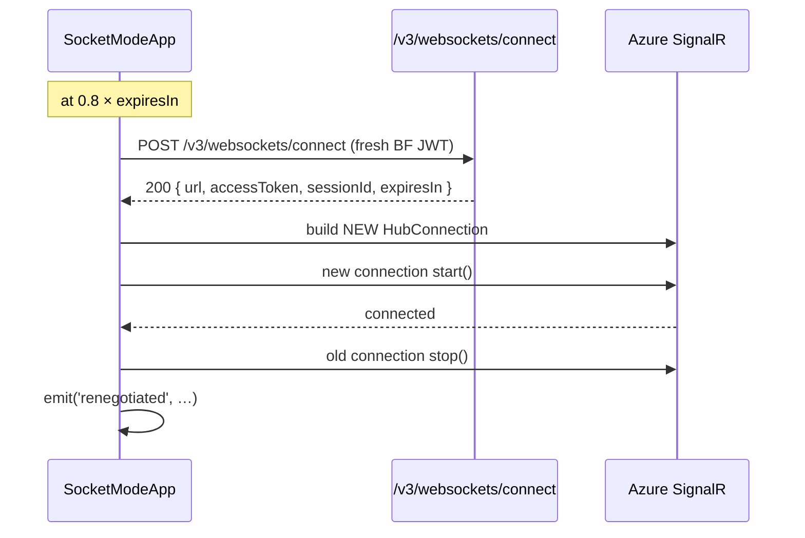

# Teams SDK (teams.ts) — Socket Mode Support

> **Status:** Draft proposal — for review before implementation.
> **Author:** rroopani
> **Last updated:** 2026-05-17

---

## 1. Goal

Let a bot developer opt into **Socket Mode** (APX → bot delivery over Azure SignalR WSS) with a single entry point. The developer picks **one** of two start calls; never both:

```ts
// HTTP delivery (today's behavior, unchanged)
const app = new App();
await app.start();

// Socket Mode delivery (new)
const app = new App();
const socketModeApp = new SocketModeApp(app);
await socketModeApp.start();      // internally calls app.start() + opens the WSS
```

`SocketModeApp.start()` is a **drop-in replacement** for `app.start()`. It owns the full lifecycle:

1. `app.initialize()` — plugins init, server route registration.
2. Plugin `onStart` callbacks fire (same as `app.start()`).
3. `app.server.start(port)` binds the HTTP listener for **invokes, OAuth callbacks, tabs, and remote functions** (this part is unchanged from the HTTP path).
4. `POST /v3/websockets/connect` negotiates an Azure SignalR session.
5. Opens the WSS and registers the `"activity"` handler.

Result: event-style activities arrive over the socket; invokes / OAuth / tabs continue to use HTTP. Replies always go over the existing `/v3/conversations/...` HTTPS APIs (a platform-side v1 limitation, not an SDK choice). The developer makes **one** `start()` call regardless of which transport they pick.

## 2. Platform contract recap (what the SDK has to speak)

| Concern | Value | Source |
|---|---|---|
| Negotiate endpoint | `POST /v3/websockets/connect` (also `{cloud}/...`, `{cloud}/{tenantId}/...`) | [`WebSocketConnectController.cs`](file:///c:/Work6/Git/async_messaging_botapiservice/BotFrontEnd.Library/Controllers/WebSocketConnectController.cs) |
| Auth | `Authorization: Bearer {BF JWT}` — same MSA token used for other `/v3/...` calls | [`WebSocketConnectService.cs`](file:///c:/Work6/Git/async_messaging_botapiservice/Library/Services/WebSocketConnectService.cs) |
| Response | `{ url, accessToken, sessionId, expiresIn }` (`expiresIn` in seconds) | `WebSocketConnectController.cs` |
| Transport | Azure SignalR Service Default protocol. Reference JS client: `@microsoft/signalr` |
| Hub method | `"activity"` (server → client) | [`SocketModeDispatcher.cs:40`](file:///c:/Work6/Git/async_messaging_botapiservice/Library/Services/SocketModeDispatcher.cs#L40) |
| Envelope | `{ type: "activity", envelopeId, cv, payload: <Bot Framework Activity> }` | `SocketModeDispatcher.cs:18-31` |
| Direction | One-way, APX → bot. No bot→APX SignalR frames in v1. | `apx.dev.md` §D5 |
| Invokes | Always HTTPS — never on socket. SDK must keep HTTP path live. | `apx.dev.md` §D5, dev guide §Limitations |
| Token rotation | Bot's responsibility. Re-negotiate before `expiresIn`. Recommended at `0.8 × expiresIn`. | Dev guide §Operational |
| Failure mode | `503` from negotiate ⇒ socket mode unavailable, bot must continue on HTTP. APX dispatcher auto-falls-back to HTTPS POST per request when no socket session exists. |

> ⚠️ The .NET `SocketModeTestClient/Program.cs` registers `connection.On<string>("ReceiveActivity", …)`. That string is **stale in the test client**. The authoritative method name from `SocketModeDispatcher.cs` is `"activity"`. The SDK MUST handler-bind to `"activity"`. We should also file a fix on the test client.

## 3. Surface design

### 3.1 Public API (TypeScript)

```ts
// Top-level export from @microsoft/teams.apps
export { SocketModeApp, SocketModeOptions, SocketModeEvents, ISocketModeClient } from '@microsoft/teams.apps';
```

```ts
export interface SocketModeOptions {
  /** Cloud route variant. Default { kind: 'global' } ⇒ POST /v3/websockets/connect. */
  readonly route?:
    | { kind: 'global' }
    | { kind: 'regional'; cloud: 'amer' | 'apac' | 'emea' | 'eudb' }
    | { kind: 'regional-tenant'; cloud: string; tenantId: string };
  /** Fraction of expiresIn at which to re-negotiate. Default 0.8. */
  readonly renegotiateAt?: number;
  /** Backoff config for reconnect/negotiate retries. */
  readonly backoff?: { minMs?: number; maxMs?: number; factor?: number; jitter?: boolean };
  /** Deduplicate envelopes by envelopeId (helpful in blue/green). Default false. */
  readonly dedupe?: boolean;
  /**
   * Continue running if /v3/websockets/connect returns 503.
   * When true, SocketModeApp.start() resolves without an active socket and the
   * bot relies on HTTPS callback delivery. Default true.
   */
  readonly fallbackOn503?: boolean;
  /** Test seam: override the SignalR client. */
  readonly client?: ISocketModeClient;
}

export class SocketModeApp<TPlugin extends IPlugin = IPlugin> {
  constructor(app: App<TPlugin>, options?: SocketModeOptions);

  /**
   * Start the App (HTTP server, plugins) AND open the Socket Mode WebSocket.
   * Drop-in replacement for app.start() — do NOT also call app.start().
   */
  start(port?: number | string): Promise<void>;
  /** Close socket AND stop the App. */
  stop(): Promise<void>;

  /** The wrapped App. Convenience accessor: socketModeApp.app.on(...) === app.on(...). */
  readonly app: App<TPlugin>;
  /** Current session id (negotiate result). Useful for logging. */
  readonly sessionId?: string;
  /** Last cv observed on an inbound envelope. */
  readonly lastCv?: string;

  /** Lifecycle events for diagnostics. */
  on<K extends keyof SocketModeEvents>(name: K, cb: SocketModeEvents[K]): this;
}

export interface SocketModeEvents {
  connected: (info: { sessionId: string; connectionId?: string }) => void;
  reconnecting: (err?: Error) => void;
  reconnected: (info: { connectionId?: string }) => void;
  closed: (err?: Error) => void;
  renegotiated: (info: { sessionId: string; expiresIn: number }) => void;
  envelope: (env: { envelopeId: string; cv?: string; type: string }) => void;
  unavailable: (info: { status: number; message: string }) => void;
}
```

### 3.2 Internal contract with `App`

`SocketModeApp` reuses what `App` already exposes — no new public method is required on the App class:

| Needs | Already on `App`? |
|---|---|
| Inject an inbound activity through the same routing pipeline | ✅ `app.onActivity({ body, token })` (already public, returns `InvokeResponse`) |
| Get the bot's MSA bearer token for negotiate | ⚠️ `app.getBotToken()` is currently `protected`. Promote to `public` (or add a thin public `getBotFrameworkToken()` wrapper). |
| Resolve `serviceUrl` for synthesized `IToken` | ✅ `app.api.serviceUrl` |
| Discover `clientId` for synthesized `IToken.appId` | ✅ `app.credentials?.clientId` (via getter) |
| Logger | ✅ `app.log` |
| Ensure init/start runs once | ✅ `app.initialize()` |

Required change: **make `App.getBotToken()` public** (currently `app.ts:704`). It is the one minimal new surface on `App` itself. Alternative: expose `app.tokenManager.getBotToken()` directly (`tokenManager` is already public on `App`), which avoids changing `App` at all. **Preferred: use `app.tokenManager.getBotToken()` and leave `App` untouched.**

## 4. File-by-file change list

### 4.1 New files (under `packages/apps/src/socket-mode/`)

| File | Purpose |
|---|---|
| `socket-mode-app.ts` | The `SocketModeApp` class. Owns lifecycle, re-negotiate timer, event emitter, envelope routing into `app.onActivity`. |
| `socket-mode-client.ts` | Thin wrapper around `@microsoft/signalr.HubConnection`. Handles `WithUrl(...)`, `accessTokenFactory`, `WithAutomaticReconnect`, `.on('activity', ...)`, `.onclose(...)`. Mockable via `ISocketModeClient` for unit tests. |
| `negotiate.ts` | `negotiate(app, options): Promise<NegotiateResult>`. Calls `POST /v3/websockets/connect[/{cloud}[/{tenantId}]]` with the BF JWT. Surfaces `503` distinctly so the caller can decide fallback. |
| `envelope.ts` | `SocketActivityEnvelope` type + `isActivityEnvelope` guard. Matches the platform shape exactly: `{ type, envelopeId, cv, payload }`. |
| `synthesize-token.ts` | Builds an `IToken` from an inbound socket payload so it can flow through `App.onActivity({ body, token })` unchanged. Marks `from: 'azure'`, `isExpired: () => false`, fills `appId`/`serviceUrl` from `app.credentials` and `activity.serviceUrl`. |
| `backoff.ts` | Tiny jittered exponential backoff (min 2 s, max 30 s, factor 2) used for negotiate and reconnect retries. |
| `index.ts` | Re-exports the public surface above. |
| `socket-mode-app.spec.ts` | Unit tests with a mock `ISocketModeClient` and `nock`/`msw` for the negotiate HTTP call. Cases below. |

### 4.2 Modified files

| File | Change |
|---|---|
| `packages/apps/package.json` | Add `"@microsoft/signalr": "^8.0.7"` to `dependencies` (it's the official JS SignalR client and works against Azure SignalR Default protocol per the dev guide). |
| `packages/apps/src/index.ts` | Re-export `./socket-mode` so consumers can `import { SocketModeApp } from '@microsoft/teams.apps'` (or via the deeper specifier shown in §3.1). |
| `packages/apps/src/app.ts` | **No source changes required** if we route via `app.tokenManager.getBotToken()`. (If we instead choose to promote `getBotToken` to public, the single edit is removing `protected` on line 704.) |
| `packages/apps/README.md` | Add a "Socket Mode" section pointing at this proposal + a minimal example. |
| `examples/` | New `examples/socket-mode/` directory mirroring `examples/echo` but starting `SocketModeApp` alongside `app.start()`. |

### 4.3 No-change components (for the reviewer's sanity check)

- `packages/api` — the negotiate endpoint is a one-off and lives inside socket-mode rather than as a generic `client.websockets.connect()`. Adding it as a first-class `Client` route is possible but not required for v1, and would bloat the public API surface for one endpoint with a niche use case.
- `packages/apps/src/http/*` — HTTP server, adapter, middleware, JWT validator unchanged. Socket mode bypasses them entirely on the inbound path.
- `packages/apps/src/router/*`, `routes/*`, `app.process.ts` — unchanged. Socket-mode activities re-enter the same `App.onActivity → App.process(event)` pipeline, so all existing handlers (`app.on('message', …)`, message routing, OAuth verify-state, etc.) work without modification.

## 5. Behavior in detail

### 5.1 Connect sequence



### 5.2 Activity delivery (event-style)



The bot's `app.on('message', …)`, etc., never knows the activity came from a socket. Any reply goes through `app.send(...)` → `ActivitySender` → HTTPS POST against `/v3/conversations/...`, unchanged.

### 5.3 Token rotation



Make-before-break to keep zero-gap delivery during the swap. If start of the new connection fails, keep the old one and back off — never tear down what works.

### 5.4 Reconnect / failure handling

| Trigger | Action |
|---|---|
| `HubConnection.onclose(err)` with no transport error | Treat as normal reconnect path: `WithAutomaticReconnect` handles it. Emit `reconnecting`/`reconnected`. |
| `HubConnection` permanently closes | Re-negotiate from scratch with jittered backoff (2 s → 30 s). |
| `1008` close from SignalR | Token expired earlier than estimated. Force immediate re-negotiate. |
| Negotiate `401` | Refresh BF JWT once via `tokenManager.getBotToken({ forceRefresh: true })` (extend TokenManager if not already supported), then retry once. If still 401, surface to caller and back off. |
| Negotiate `503 "Socket mode is not available."` | Emit `unavailable`. If `fallbackOn503` (default true): resolve `start()` without an active socket and stay quiet — APX will deliver to the HTTPS endpoint, which is still running. If `fallbackOn503: false`: reject `start()`. |
| Negotiate `503 "Unable to allocate WebSocket session."` | Retry with jittered backoff (transient). |
| Stopped via `stop()` | Cancel timers, close hub connection. `start()` is callable again. |

### 5.5 Synthesized inbound `IToken`

The platform validates the bearer token once at `/v3/websockets/connect`. Subsequent activity frames carry no per-activity JWT. The SDK synthesizes one so the activity can re-enter `App.onActivity` without changing `HttpServer`/router types. Every field on `IToken` (see [packages/api/src/auth/token.ts](packages/api/src/auth/token.ts)) is populated so any downstream consumer behaves identically to the HTTP path:

```ts
const token: IToken = {
  appId:          app.credentials?.clientId ?? '',
  appDisplayName: app.name,                                    // best-effort, matches HTTP path
  tenantId:       payload.conversation?.tenantId
                  ?? app.credentials?.tenantId,
  serviceUrl:     payload.serviceUrl ?? app.api.serviceUrl,
  from:           'azure',                                     // service-to-service caller type
  fromId:         app.credentials?.clientId ?? '',
  expiration:     Date.now() + sessionExpiresIn * 1000,        // tracks the SignalR access token
  isExpired:      (bufferMs = 5 * 60_000) =>
                    Date.now() + bufferMs >= this.tokenExpiry,
  toString:       () => '<socket-mode-synthesized>',           // never used by app.process
};
```

This is safe because:
- The HTTP `JwtValidator` / `ServiceTokenValidator` middleware is **not** in the socket path — we never feed the synthesized token to JWT validation.
- [`app.process`](packages/apps/src/app.process.ts) reads `activity.serviceUrl || token.serviceUrl` and otherwise builds the `ConversationReference` from the **activity body**, not the token. Both fields are present on socket-delivered envelopes exactly as on HTTP.

## 5.6 Activity-type parity — what flows through, what doesn't

**Guarantee:** every activity type that today reaches a handler via the HTTP `/api/messages` endpoint will reach the same handler unchanged when SocketModeApp is active. SocketModeApp does not filter, transform, or special-case activities by type — it hands the envelope's `payload` to `app.onActivity({ body, token })` and the existing router does the rest.

Concretely, this means each of the following keeps working with zero new code:

| Activity type / `name` | Existing entry point (handler API) | Socket-mode behavior |
| --- | --- | --- |
| `message` | `app.on('message', …)`, `app.message(/regex/, …)` | ✅ Delivered |
| `messageReaction` | `app.on('messageReaction', …)` | ✅ Delivered |
| `messageUpdate` (edit) | `app.on('messageUpdate', …)` ([routes/message-update.ts](packages/apps/src/routes/message-update.ts)) | ✅ Delivered |
| `messageDelete` (soft delete) | `app.on('messageDelete', …)` ([routes/message-delete.ts](packages/apps/src/routes/message-delete.ts)) | ✅ Delivered |
| `conversationUpdate` (members added/removed, channel created/renamed/deleted, team renamed, etc.) | `app.on('conversationUpdate', …)` and the sub-routes in [routes/conversation-update.ts](packages/apps/src/routes/conversation-update.ts) | ✅ Delivered |
| `installationUpdate` (`add`, `remove`) | `app.on('install.*', …)` ([routes/install.ts](packages/apps/src/routes/install.ts)) | ✅ Delivered |
| `event` (system events e.g. `application/vnd.microsoft.meetingStart`, `meetingEnd`, `readReceipt`) | `app.on('event', …)` ([routes/event.ts](packages/apps/src/routes/event.ts)) | ✅ Delivered |
| `typing` | `app.on('typing', …)` | ✅ Delivered |
| `endOfConversation` | `app.on('endOfConversation', …)` | ✅ Delivered |
| Mention dispatch | `app.on('mention', …)` (post-routing, derived from activity entities) | ✅ Delivered — the dispatch is driven off the body, not the transport |
| Catch-all | `app.on('activity', …)` | ✅ Delivered |
| **`invoke` (all `name`s — `signin/tokenExchange`, `signin/verifyState`, `composeExtension/*`, `task/fetch`, `task/submit`, `adaptiveCard/action`, `fileConsent/invoke`, …)** | [routes/invoke/*](packages/apps/src/routes/invoke/) | ⛔ **Stays on HTTPS by platform design.** The bot's `/api/messages` endpoint continues to receive invokes regardless of socket mode. This is enforced **on the APX side**, not in the SDK — APX's `SocketModeDispatcher` guards `!(botActivity is BotInvokeActivity)`. See [`apx.dev.md`](file:///c:/Work6/Git/teams-conv-platform-specs/features/socket-mode/apx.dev.md) §D5. |

**Defensive behavior in the SDK**: if for any reason an `invoke` frame *does* arrive on the socket (e.g. future platform change, mis-flighted dispatcher), the SDK still routes it through `app.onActivity` so existing invoke handlers fire. The resulting `InvokeResponse` is discarded — there is no v1 wire frame to send it back over the socket. This is a `log.warn` event but not an error. **The bot developer should always keep the HTTP server running for invokes.**

**Why this works automatically (no per-type code in SocketModeApp):**

- The HTTP path goes `HttpServer.handleRequest → onRequest(event) → App.onActivity → App.process → router.select(activity)`.
- The socket path goes `HubConnection.on('activity') → SocketModeApp.dispatch → App.onActivity → App.process → router.select(activity)`.
- The two paths merge at the same `App.onActivity({ body, token })` call. From that line onward — including all of [app.process.ts](packages/apps/src/app.process.ts) — the code does not see, query, or branch on which transport delivered the activity. Adding a new activity type or invoke `name` in the future automatically works for both paths.

### 5.7 Concurrent connections — why and how many

#### TL;DR — why the Teams SDK does NOT need 10 connections

The Slack ecosystem expects bots to open up to 10 simultaneous WSS connections. **For Teams bots on APX, the right default is 1.** The Slack rationale doesn't transfer because the two platforms have opposite dispatch models:

| Slack rationale for many connections | Why it doesn't move the needle on APX |
| --- | --- |
| **Load distribution** — Slack shards events across the open sockets, so 10 sockets ≈ 10× throughput. | APX dispatches via Azure SignalR group fan-out — **every session for the same `botKey` receives every event** ([`apx.dev.md`](file:///c:/Work6/Git/teams-conv-platform-specs/features/socket-mode/apx.dev.md) §D5). Opening more sockets does NOT add throughput; it just multiplies the bandwidth/CPU per event by `N`. |
| **Graceful restart** — overlap a fresh connection with the draining old one to avoid event loss during a scheduled disconnect. | The SDK already does **make-before-break** on every re-negotiate (§5.3). A single connection survives every scheduled token rotation without a delivery gap. |
| **Active-active redundancy** — keep multiple parallel connections so a single socket drop doesn't pause the app. | The supported APX answer is **horizontal pods**, not intra-process sockets — the platform dev guide's blue/green section explicitly says "Run one session per process." Two pods × one socket each gives the same fault tolerance with `1×` the per-bot bandwidth, not `2×`. |
| **High event volume from a single workspace** — Slack apps can saturate a single socket. | Not a concern for Teams in v1: APX's per-bot event rates are nowhere near a single-socket bottleneck (Azure SignalR Standard tier alone bursts at ~30k msg/s per unit, far above any single bot's event rate). |

In short: **APX's fan-out semantics make extra sockets a cost without a benefit for any of the reasons Slack uses them.** The one APX-specific use case where `connections > 1` *does* help — surviving a single-process socket drop without waiting for the reconnect backoff — is niche enough to be an opt-in knob rather than the default.

**Concrete recommendation:**

| Deployment | Recommended `connections` |
| --- | --- |
| Single pod, accept brief delivery pauses during reconnect | `1` (default) |
| Single pod, want belt-and-suspenders against a single socket drop | `2` |
| Two or more pods | `1` per pod — pod count already gives active-active redundancy |
| Anything chasing throughput | `1` per pod, scale by **adding pods**, not sockets |

The SDK still allows up to `10` to match Slack ecosystem muscle memory, but nothing in the APX model rewards going above `2` from a single process.

#### Slack's model (for context)

Slack's Socket Mode lets an app open up to 10 simultaneous WSS connections to its gateway ([Slack docs: Connections](https://docs.slack.dev/apis/events-api/using-socket-mode/#connections)). Slack's documented reasons:

1. **Graceful restarts** — pre-warm a new connection before a scheduled disconnect.
2. **Load distribution** — Slack distributes events *across* the open connections so a single slow consumer doesn't bottleneck event delivery.
3. **Active-active redundancy** — zero-downtime app restarts by overlapping a new fleet of connections with the draining old one.

#### APX's model is different

APX dispatches via Azure SignalR group `bot_{botKey}` and the platform spec ([`apx.dev.md`](file:///c:/Work6/Git/teams-conv-platform-specs/features/socket-mode/apx.dev.md) §D5) explicitly states:

> Per-bot fanout. **All sessions for the same `botKey` receive every event for that bot.** Run one session per process; do not shard events by session.

That means:

| Reason for multi-connection | Slack | APX | Verdict for Teams SDK |
| --- | --- | --- | --- |
| Graceful restart (pre-warm next connection before disconnect) | ✅ Applies | ✅ Applies — but the SDK already does **make-before-break** on every re-negotiate (§5.3), so a single connection already gets this benefit. | Low marginal value; useful as belt-and-suspenders for hostile networks. |
| Load distribution across connections | ✅ Applies — Slack shards events | ⛔ **Does not apply** — APX fans out; every connection gets every event. Adding connections does NOT raise per-bot throughput. | Inapplicable. |
| Active-active redundancy across processes/pods | ✅ Applies | ✅ Applies — multiple pods opening sockets is the documented blue/green story (§Operational guidance in the dev guide). | Already supported by deploying multiple pods. |
| Active-active redundancy **within a single process** | ✅ Applies | ✅ Applies — survives a transient drop of one socket without a delivery gap. | Net new value for single-process bots. |

#### SDK decision

Support `connections: N` with `N ∈ [1, 10]`, default `1`.

- The cap of 10 matches the Slack ecosystem expectation; for APX, 10 is a soft upper bound because each session gets the full event stream (so `N=10` is ~10× the bandwidth/CPU per bot vs `N=1`).
- The default of `1` matches the platform spec's "one session per process" recommendation.
- When `connections > 1`, the SDK **auto-enables `dedupe`** — APX fan-out guarantees that every envelope arrives `N` times, and the bot must see each one exactly once. Auto-enable removes the foot-gun of forgetting to set this.
- Each connection has independent: negotiate, access token, re-negotiate timer, reconnect backoff. They share the dedup set so `app.onActivity` is invoked exactly once per `envelopeId` across the fleet of connections.
- Activity routing is unchanged — `app.onActivity({ body, token })` runs once per unique envelope; the slot that delivered it is internal.

**When should a Teams bot developer set `connections > 1`?**

- They need belt-and-suspenders redundancy inside a single process (e.g., a single-pod hosted bot where a momentary socket drop would otherwise pause event delivery for the duration of the reconnect backoff).
- They are coming from the Slack ecosystem and expect the same knob.
- For higher event throughput per-bot: **no — increase pod count instead.** Multiple APX sessions for the same bot don't add throughput because every session gets every event.

**When should they NOT?**

- They're already running ≥ 2 pods. The pod count already gives them active-active redundancy; adding intra-process connections just multiplies the dedup work without adding resilience.
- They are bandwidth-constrained or running on a small instance. `N` sockets = `N×` the inbound bandwidth per event.

### 5.8 Plugin parity

Plugins registered on the App expose `onActivity`, `onActivityResponse`, `onActivitySent`, and `onError`. Each of these is invoked from inside `App.process` — i.e. *downstream* of where the socket and HTTP paths merge. Concretely:

- `onActivity` is invoked for every socket-delivered activity exactly as for HTTP-delivered activities ([app.process.ts:73-91](packages/apps/src/app.process.ts#L73-L91)).
- `onActivitySent` fires when the bot replies. Replies still go over HTTPS via `app.send` / `ActivitySender` — no change.
- `onActivityResponse` fires after routing completes. For socket-delivered activities the response is built locally and not sent over the wire (v1 has no ack frame), but the plugin hook still fires.

Plugins that subclass `IPlugin` and rely on these hooks need no awareness of socket mode.

## 6. Sample bot (TypeScript)

```ts
import { App, SocketModeApp } from '@microsoft/teams.apps';

const app = new App({
  // clientId / clientSecret picked up from env, same as today
});

// Regular handlers — no change.
app.on('message', async ({ activity, send }) => {
  await send({ type: 'message', text: `echo: ${activity.text}` });
});

const sm = new SocketModeApp(app, {
  renegotiateAt: 0.8,
  dedupe: true,             // safe with blue/green deploys
  fallbackOn503: true,      // happy to fall back to HTTPS
});

sm.on('connected',    ({ sessionId }) => console.log('socket up', sessionId));
sm.on('renegotiated', ({ sessionId }) => console.log('rotated', sessionId));
sm.on('unavailable',  ({ message })   => console.warn('socket unavailable:', message));

await sm.start();   // <-- single entry point. Starts the App AND opens the WSS.
```

For HTTP-only delivery (the existing model), the developer just uses `app.start()` and doesn't construct a `SocketModeApp` at all.

## 7. Test plan

Unit tests in `socket-mode-app.spec.ts` against a mock `ISocketModeClient`:

1. `start()` calls negotiate with the BF JWT, then `HubConnection.start()`. (`nock` the POST.)
2. Inbound `"activity"` frame → `app.onActivity` called once with `body=payload` and a synthesized token. Handlers fire.
3. Re-negotiate fires at `0.8 × expiresIn`, swaps connection make-before-break.
4. `stop()` cancels the re-negotiate timer and closes the hub.
5. `503 "Socket mode is not available"` with `fallbackOn503: true` resolves `start()`, emits `unavailable`, does NOT throw.
6. Dedupe: two frames with the same `envelopeId` route the activity exactly once.
7. Token expired mid-stream (`1008` close) → immediate re-negotiate, not waited-out backoff.
8. Activity with `type: 'invoke'` never appears on the socket — but if it does (test only), it still routes through `app.onActivity` and produces an `InvokeResponse` that we discard (no ack frame in v1).

Integration smoke test (manual against APX dev tenant):
- Echo bot + `SocketModeApp` connected to `https://smba.trafficmanager.net`.
- Confirm `cv` and `sessionId` appear in logs alongside each replied message.
- Kill the socket; confirm APX falls back to HTTPS POST automatically.

## 8. Open questions for review

1. **`getBotToken({ forceRefresh })`** — does `TokenManager` already support forced refresh? If not, we'll need to extend it (small, but worth flagging now since the negotiate-401 retry path depends on it).
2. **Cloud routing** — should `SocketModeApp` derive the regional route automatically from `app.cloud`, or always default to global and require explicit opt-in? I'm leaning "always derive from `app.cloud`" for ergonomic parity with the existing HTTP path; not a blocker either way.
3. **CV propagation** — the platform spec asks bots to log the envelope `cv` on every frame and on every outbound reply. Should `SocketModeApp` push the `cv` into `app.log` context (via a child logger) so all downstream logs in that activity carry it automatically? I think yes, but it's the kind of choice that warrants an explicit decision.
4. **Multi-region** — the dev guide notes one socket per bot process. If a customer runs N pods, every pod opens one socket and APX fans out the event to all of them. Should the SDK ship a simple "join-only-N-pods" gate, or leave that to the deployer? I'd leave it to the deployer — out of scope for v1.
5. **Package import path** — `import { SocketModeApp } from '@microsoft/teams.apps/socket-mode'` requires a deep export entry in `packages/apps/package.json`. Easier alternative: top-level export from `@microsoft/teams.apps`. Both work; flagging the package.json change either way.

## 9. Out of scope (v1)

- Bot→APX SignalR frames (acks, invoke responses). Awaits APX v2.
- `ack` / `ping` / `disconnect` frame handling beyond logging.
- Standalone npm package — v1 ships inside `@microsoft/teams.apps`. We can extract later if `@microsoft/signalr` size becomes a concern.
- Replacement of the HTTP path for OAuth/tabs/invokes/remote functions.
- Mooncake / Airgap clouds — APX itself isn't there yet.

---

## Appendix A — Quick reference: the wire envelope

```jsonc
{
  "type": "activity",
  "envelopeId": "32-hex-chars",      // unique per frame
  "cv": "base.extension",            // APX correlation vector
  "payload": { /* Bot Framework Activity JSON */ }
}
```

SignalR hub method name: `"activity"` (server → client).

## Appendix B — Mapping from .NET reference to TypeScript

| .NET (`SocketModeTestClient/Program.cs`) | teams.ts equivalent |
|---|---|
| `HubConnectionBuilder().WithUrl(url, o => o.AccessTokenProvider = …)` | `new HubConnectionBuilder().withUrl(url, { accessTokenFactory: () => accessToken })` (`@microsoft/signalr`) |
| `.WithAutomaticReconnect()` | `.withAutomaticReconnect()` |
| `connection.On<JObject>("activity", OnActivityAsync)` | `connection.on('activity', envelope => …)` |
| `connection.Closed += …` | `connection.onclose(err => …)` |
| `Task.Delay(0.8 × expiresIn)` + dispose + restart | `setTimeout(renegotiate, 0.8 × expiresIn × 1000)` with make-before-break |
| `JObject.Value<string>("payload")` | `(envelope as SocketActivityEnvelope).payload` |
