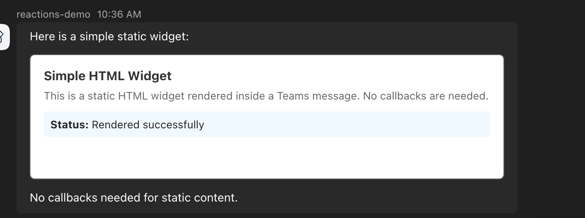
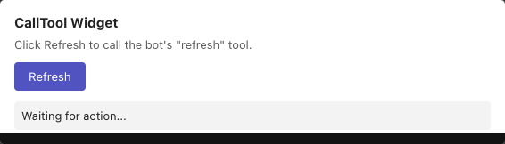
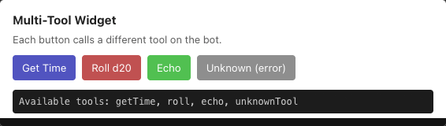
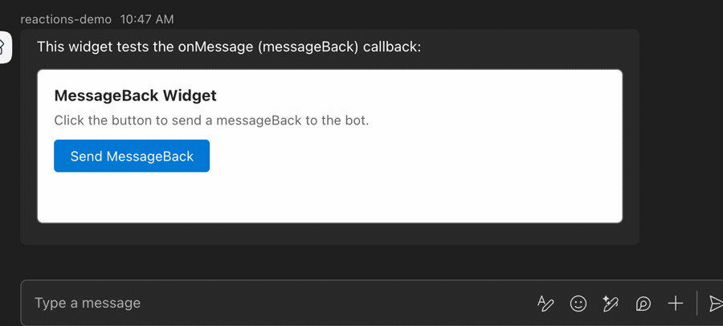
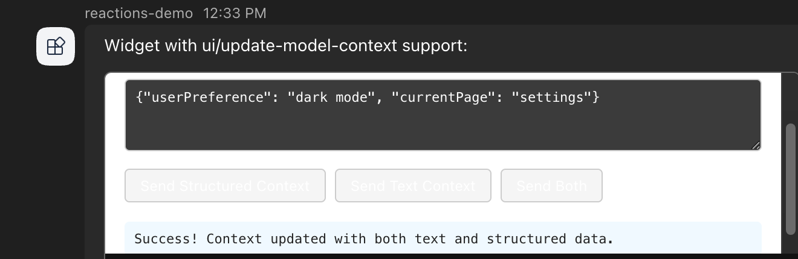
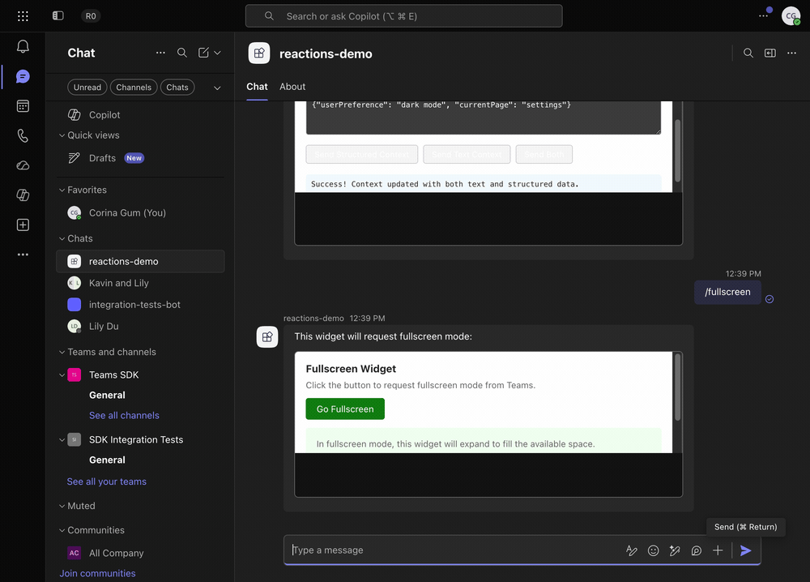
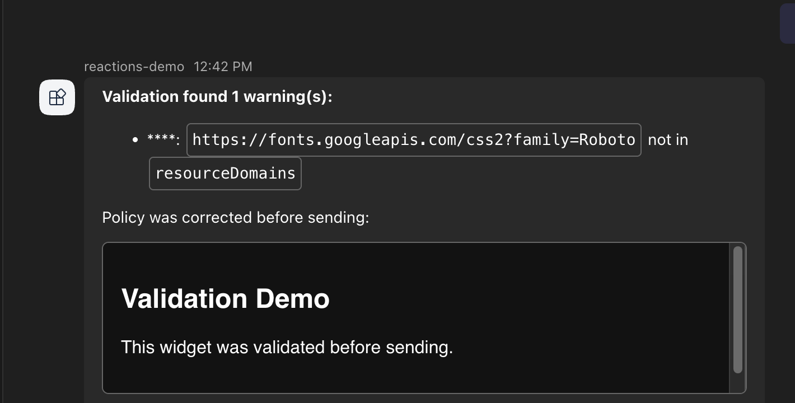
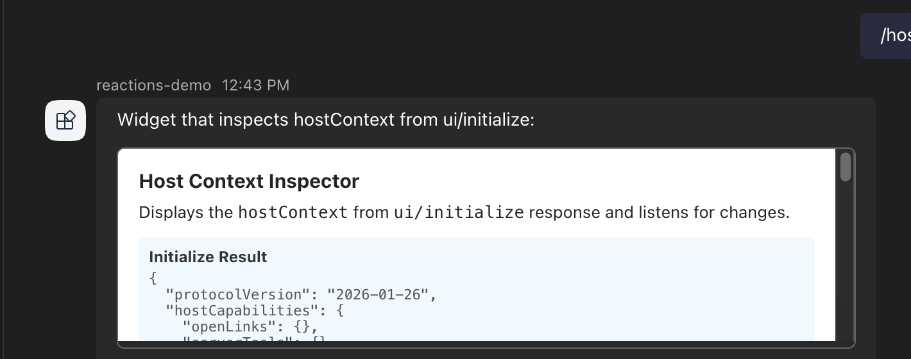

# HTML Widgets Example

This example bot demonstrates the HTML widget contract for Teams bots using the Teams SDK.

## Demo

The bot renders several HTML widgets in Teams.
Each command below maps to a widget that exercises part of the widget contract.

### Static rendering (`/simple`)

A static widget renders directly from markdown with no callbacks.



### Tool call round-trip (`/calltool`)

Clicking the widget button calls a bot tool via an `htmlwidget/calltool` invoke, and the widget renders the returned result.



### Multi-tool dispatch (`/multi`)

The widget exposes several buttons that each dispatch to a different bot tool, showing per-tool arguments and results.



### messageBack round-trip (`/messageback`)

Clicking the widget button sends a `messageBack` to the bot, which echoes the received value.



### Update model context (`/context`)

The widget sends structured and text context to the model using `ui/update-model-context`.



### Fullscreen display mode (`/fullscreen`)

The widget requests fullscreen mode from Teams and expands to fill the available space.



### Payload validation (`/validate`)

The SDK validates the widget payload before sending and reports policy warnings.



### Host context inspection (`/hostcontext`)

The widget reads the `hostContext` from the `ui/initialize` response.



## What it shows

| Command | Purpose | Widget callbacks |
|---------|---------|-----------------|
| `/simple` | Static widget rendering (before + after markdown) | None |
| `/calltool` | Widget calling bot tools | `htmlwidget/calltool` invoke |
| `/messageback` | Widget sending messageBack | `onMessage` |
| `/fullscreen` | Widget requesting display mode change | `onRequestDisplayMode` (client-side) |
| `/multi` | Multiple tool dispatch | `htmlwidget/calltool` with different tool names |
| `/openlink` | Widget opening links via host | `ui/open-link` |
| `/context` | Widget updating model context | `ui/update-model-context` |
| `/hostcontext` | Inspecting host context from initialize | `ui/initialize` response |
| `/validate` | Security policy validation demo | None |

## Architecture

```
Bot sends message:
  textFormat: 'extendedmarkdown'
  text: "...\n```html-widget\n{JSON payload}\n```"

Teams client:
  McpWidgetRenderer loads widget HTML in sandboxed iframe
  MCP Apps protocol provides tools/call via postMessage

Widget calls tool:
  postMessage -> McpWidgetRenderer -> htmlwidget/calltool invoke -> Bot

Bot returns (invoke response body):
  {
    responseType: 'htmlwidget/calltoolresult',
    callToolResult: { content: [...], structuredContent: {...}, isError: false }
  }
```

## Running

1. Copy credentials:
   ```
   cp ../../../bots/.env .env
   ```

2. Start a devtunnel and update the Azure Bot endpoint

3. Run the bot:
   ```
   npm run dev
   ```

4. In Teams, message the bot with `/help` to see available commands

## Note on widget HTML

The widget HTML in `src/widgets/` is static HTML for rendering verification.
Interactive behavior (callTool, messageBack, displayMode) requires the
`@modelcontextprotocol/ext-apps` SDK which is provided by the Teams widget host
page (`mcpwidget.html` on `widget-renderer.usercontent.microsoft`).

The bot-side code (`widget.callTool` handler in `src/index.ts`) is the primary
test target. It verifies that:
- The SDK's invoke route alias correctly matches `htmlwidget/calltool`
- The typed handler receives `{ name, arguments }` in `activity.value`
- The response body uses the `IHtmlWidgetCallToolResponse` wrapper format (`{ responseType: 'htmlwidget/calltoolresult', callToolResult: {...} }`)
